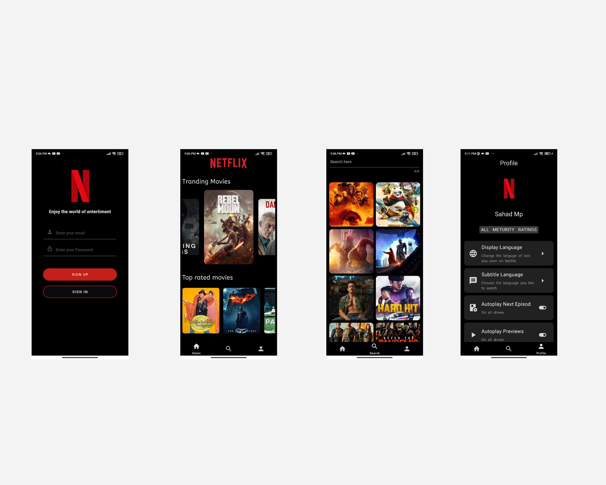

# Netflix - Mini Project 

This project is a clone of the popular streaming platform Netflix, developed using Flutter for the frontend and Firebase for backend services. The app replicates the core features and functionalities of Netflix, allowing users to browse a vast library of movies and TV shows, create personalized watchlists, and stream content seamlessly.

### Key Features:

#### User Authentication
#### Browse Content
#### User Profiles
#### Responsive Design 

## App Screens:

